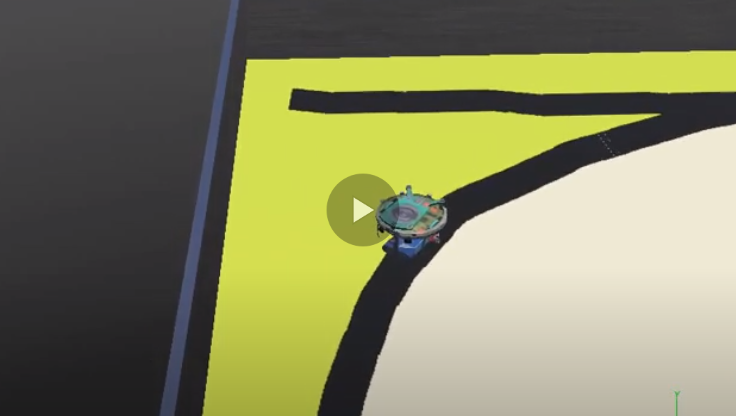

# Lab 2 – Line-following State-Machine

## Objectives
The goal of this lab is to learn more about controllers in Webots, and to implement a line-following behavior in Python, based on a state-machine. 


###### Figure 1. BotStudio screenshot with the line-follower state-machine (left) and values of e-puck sensors and motor speeds (right).

## The e-puck robot
Webots contains a realistic model of e-puck, a small differential drive mobile robot. The movement of this type of robot is controlled by adjusting the speed of each wheel. The robot also has several sensors. 

To detect obstacles, e-puck contains 8 infra-red distance sensors around its body. Other 3 infra-red sensors are mounted under its base, pointing to the floor, which enables the implementation of a line-following behavior. 

A detailed explanation of the e-puck robot and how to use in Webots is available [here](https://cyberbotics.com/doc/guide/epuck).

## Pre-requisites
You must have Webots R2022a (or newer) properly configured to work with Python. You must know how to create a robot controller in Python and how to run a simulation. If you are still missing any of those, please go back to [Lab 1](../Lab1/ReadMe.md) and complete the corresponding tasks.

## Tasks
You are going to load an example world that shows a line-follower behavior implemented with a state machine. First, you will be able to play with a simple graphical programming interface to understand and modify the state machine. Then, you will built a line-following behavior in Python.

1. Click on “Open Sample Worlds” and go to `robots > gctronic > e-puck` and select `e-puck_botstudio_with_floor_sensors.wbt`. You should see a world as shown in Figure 2.


###### Figure 2. Webots screenshot with the world “e-puck_botstudio_with_floor_sensors.wbt”.


2. Double-click on the e-puck robot: a new window shows the BotStudio, which is a graphical interface to build simple programs for the e-puck robot (see Figure 1). The BotStudio shows a line-follower behavior implemented in the form of a state-machine.

3. Start the simulation on the Webots screen by clicking the “play” button in the top menu. The robot will not move. To start the robot controller, you must click on the black upward pointing arrow in the BotStudio screen (Figure 1). 

4. Observe the behavior of the robot in the simulation. At the same time, observe the BotStudio window. Note the transitions between states and the measurements indicated by the sensors on the e-puck viewer (on the right side of the BotStudio window). The e-puck viewer shows the values returned by each of the robot sensors while the simulation is running. 

5. Now, click again on the upward pointing arrow in the BotStudio screen to stop the robot.

6. In the BotStudio window, click on the states “forward”, “turn left” and “turn right” and observe the e-puck viewer. Do the same for the conditions for transition between states. 

7. Play a bit with the values of motor speeds and sensors to understand their effect in the behavior of the robot. 

8. Modify the values of motor speed and sensors to make the robot follow the line as fast as possible, without missing it. 

9. Follow [Webots Tutorial 4](https://cyberbotics.com/doc/guide/tutorial-4-more-about-controllers?tab-language=python) to better understand the e-puck model and how to control it.

10. Finally, implement the line-follower behavior in Python using what you learned from Tutorial 4. Create a new controller in Python and write a program that implements the same state-machine shown in the BotStudio example. You can use the parameters that you think are best. 

## Ground sensors
In Tutorial 4 you have an example code using the distance sensors around the robot. To detect the line on the floor you have to use the ground sensors, instead. The simulator also treats those as distance sensors because they are of the same type (infrared sensors). In Python you will access the ground sensors as follows:

```
# To initialize the ground sensors:

gs = []
gsNames = ['gs0', 'gs1', 'gs2']
for i in range(3):
    gs.append(robot.getDevice(gsNames[i]))
    gs[i].enable(timestep)


# ...
# To read the ground sensors inside the main loop:

    gsValues = []
    for i in range(3):
        gsValues.append(gs[i].getValue())
    
    
# ...
# To read sensor values inside the main loop:

    line_right = gsValues[0]
    line_center = gsValues[1]
    line_left = gsValues[2]

```

If you need inspiration, check the [template code available here!](../Lab2/line_following_template.py)

## Conclusion
After following this lab you should know more about the e-puck robot model, how to program a controller for it in Python, and how to program a robot behavior based on state-machine. 

## Solution
Try to implement the state-machine code yourself before checking the solution! After a successfull implementation, or if you need inspiration, an example code is available [here](../Lab2/line_following_behavior.py).

The video below shows the solution code in action:
[](https://youtu.be/nW06dLEe-AU).

## Challenge: Obstacle Avoidance
Change the state-machine **in Python** to make e-puck avoid obstacles placed on its way. You can choose the type of obstacle to add: different formats might require different strategies of obstacle avoidance. Obstacles with round or rectangular shape usually are the less demanding, while obstacles with U-shape require more complex strategies.

An illustration of obstacle avoidance with state-machine is given in Figure 3.


###### Figure 3. Illustration of obstacle avoidance strategy added to the existing state-machine.

## Next Lab
Go to [Lab 3](../Lab3/ReadMe.md) - Odometry-based Localization

Back to [main page](../README.md).
