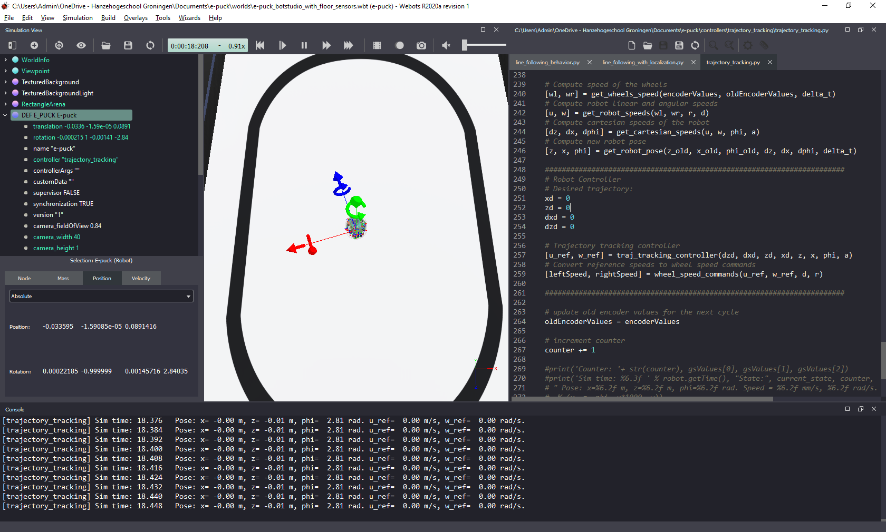

# Lab 5 – Trajectory Tracking Controller

## Objective
The goal of this lab is to implement a controller that enables the robot to follow a trajectory. The same controller can be used as a "go-to-position" controller. 


###### Figure 1. Webots screenshot - at the console (bottom) you see reference values of linear speed _u_ref_ and angular speed _w_ref_ generated by the trajectory tracking controller.

## Pre-requisites
* You must have Webots R2022a (or newer) properly configured to work with Python (see [Lab 1](../Lab1/ReadMe.md)).
* You must know how to create a robot controller in Python and how to run a simulation (see [Lab 1](../Lab1/ReadMe.md)). 
* You should have a working solution of [Lab 3](../Lab3/ReadMe.md). 

## Tasks
Your main task is to write code to implement the functions below to add the controller to your line-following behavior from Lab 3. In the main loop of your program, those functions should be called in a sequence:

```
# Trajectory tracking controller
[u_ref, w_ref] = traj_tracking_controller(dxd, dyd, xd, yd, x, y, phi, a)

# Convert reference speeds to wheel speed commands
[leftSpeed, rightSpeed] = wheel_speed_commands(u_ref, w_ref, D, R)
```

The variable _a_ contains the distance [m] between the point whose position is being controlled and the center point between the wheels. The value of _a_ can be arbitrary. The smaller the value of _a_, the closer to the center the controlled point is. But, _a_ **cannot** be equal to zero. Very small values can cause accuracy problems due to rounding errors. Recommended values are 'a = 0.05' or 'a = 0.1'. The other variables used in the functions above were defined in [Lab 3](../Lab3). 

Explanation about the trajectory tracking controller can be found in section 4 of [[1](https://www.intechopen.com/books/applications-of-mobile-robots/motion-control-and-velocity-based-dynamic-compensation-for-mobile-robots)]. The controller equation to be implemented here is equation (20). This controller was first presented in [[2]](https://www.sciencedirect.com/science/article/abs/pii/S0967066108000373?via%3Dihub), where more details about its stability are given. See references at the bottom of this page. 

The tasks are listed below:

1. **Write the function `traj_tracking_controller(dxd, dyd, xd, yd, x, y, phi, a)`** to calculate reference values of linear and angular velocities. Those values should later be used to calculate the reference speeds of each wheel. Test your code before moving to the next step.
2. **Write the function `wheel_speed_commands(u_ref, w_ref, D, R)`** to calculate the reference speeds for the left and right wheels. Those are the values that need to be sent to the wheel controllers for the robot to follow the desired trajectory.
3. **Test the trajectory tracking controller** using the desired values below. You might need to adjust the controller gains.
```
xd = 0.0	# desired position x [m]
yd = 0.0	# desired position y [m]
dxd = 0.0	# desired speed in x [m/s]
dyd = 0.0	# desired speed in y [m/s]
```
4. **Test different values of desired positions xd, yd** and check if the robot behaves as expected. If you keep the desired speeds as zero, changing the values of xd and yd should make the controller behave as a `go-to-position` controller. 

I recommend you try to modify your code from Lab 3 to implement the trajectory-tracking controller. Try doing it yourself, first. If your code is not working, or you need inspiration, you can use the [provided template](../Lab5/lab5_template.py). 

### Other details

Position (x=0, y=0) is in the center of the track. To facilitate the comparison with the speeds calculated by Webots, print the values calculated by your functions, as shown in Figure 2. 



###### Figure 2. Webots screenshot showing robot pose calculated by the simulator (left) and by the Python code (bottom).


## Think about the following questions

* Considering that you are using odometry-based localization, how does it affect the performance of the trajectory-tacking controller?
* What would you change in the code for the controller to work as a pose controller (final position + orientation)?

## Solution
Try to implement the code yourself before checking the solution! After a successfull implementation, or if you need more inspiration than the template, an example code is available [here](../Lab5/trajectory_tracking_controller.py).

## Challenge: Generate a Trajectory
Create the functions to generate a trajectory of your choice inside the field. The functions must be properly defined to generate desired positions `(xd, yd)` and speeds with their corresponding time derivates `(dxd, dyd)`. 

You are free to choose the generated trajectory, as long as:
* it moves the robot along both x and y axes; and
* it is possible for the robot to follow it (positions and speed).

Adjust the controller gains to make your robot follow the trajectory with as little error as possible. 

In your demonstration, you have to show:
* the value of distance error (euclidean distance between the actual robot position and desired position) at every cycle;
* that the robot can follow the trajectory using the trajectory-tracking controller;
* that your robot can follow different trajectories (by changing the parameters of your equations `(xd, yd, dxd, dyd)`) without modifying its controller. 

## Conclusion
After following this lab you should know how to implement moving controllers for mobile robots, especially to go to position and follow a trajectory.

## References
[[1] Martins, Felipe Nascimento, and Alexandre Santos Brandão. "Motion control and velocity-based dynamic compensation for mobile robots." Applications of mobile robots (2018).](https://www.intechopen.com/books/applications-of-mobile-robots/motion-control-and-velocity-based-dynamic-compensation-for-mobile-robots)

[[2] Martins, F. N., Celeste, W. C., Carelli, R., Sarcinelli-Filho, M., & Bastos-Filho, T. F. (2008). An adaptive dynamic controller for autonomous mobile robot trajectory tracking. Control Engineering Practice, 16(11), 1354-1363.](https://www.sciencedirect.com/science/article/abs/pii/S0967066108000373?via%3Dihub)


## Next Lab
Go to [Lab 6](../Lab6/ReadMe.md) - Combine Behaviors to Execute a Complex Mission

Back to [main page](../README.md).
